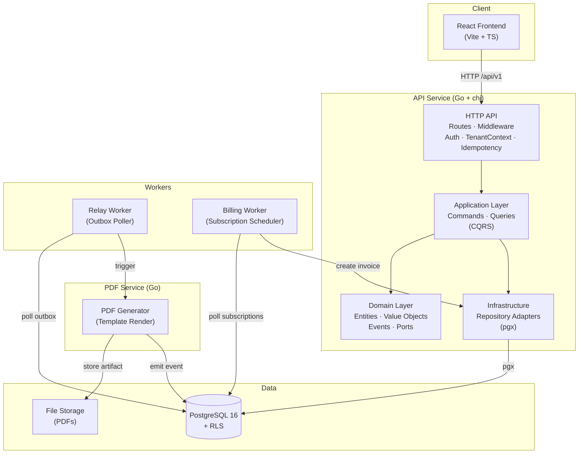
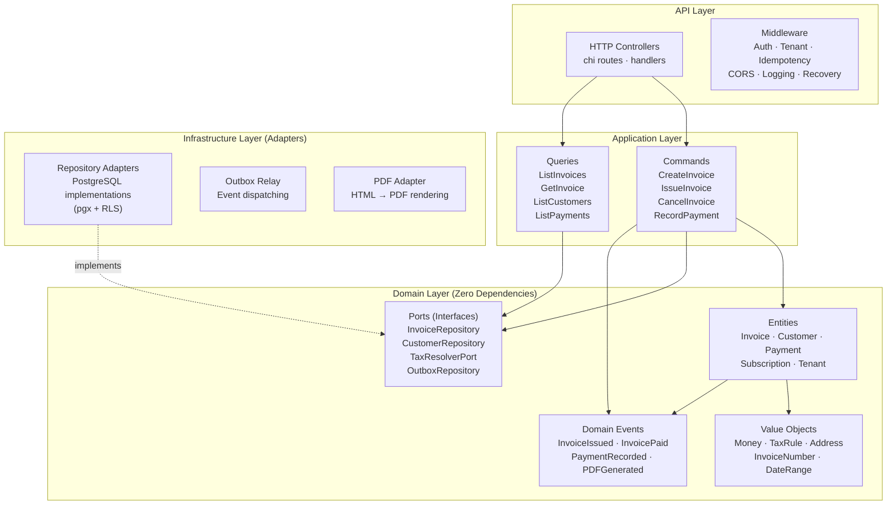
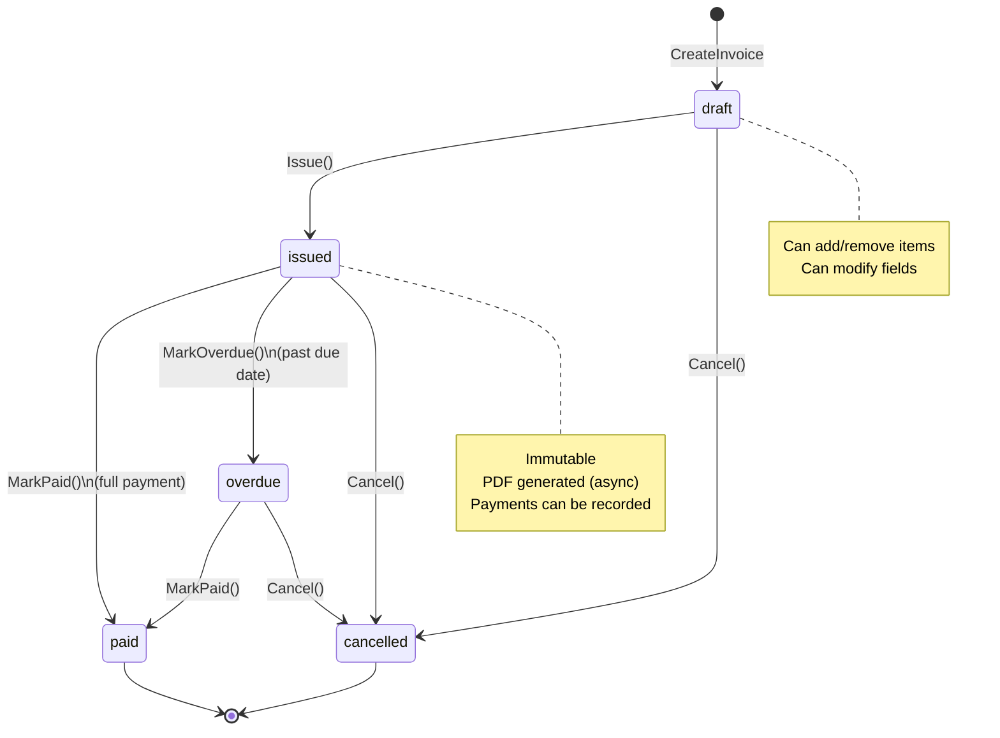
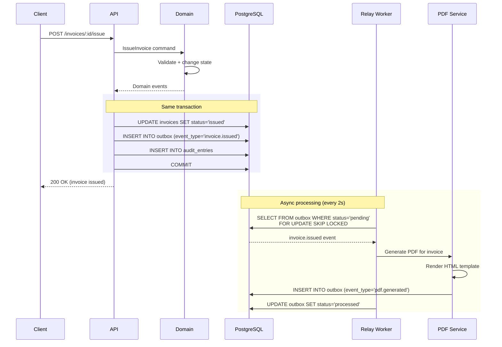
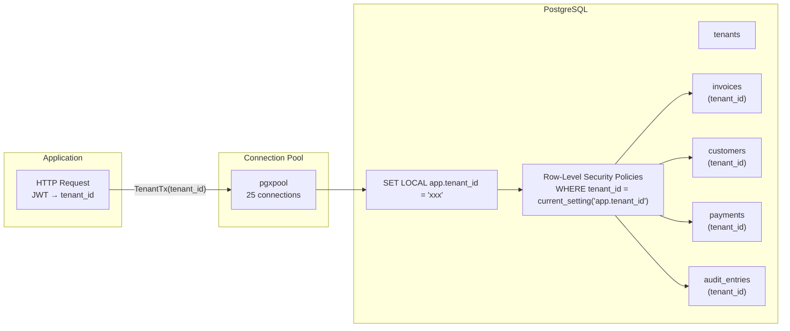
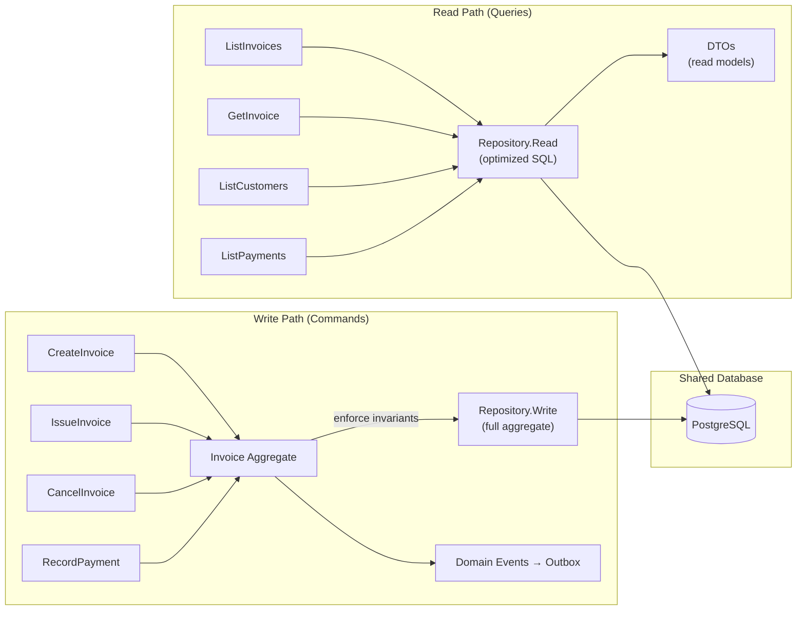
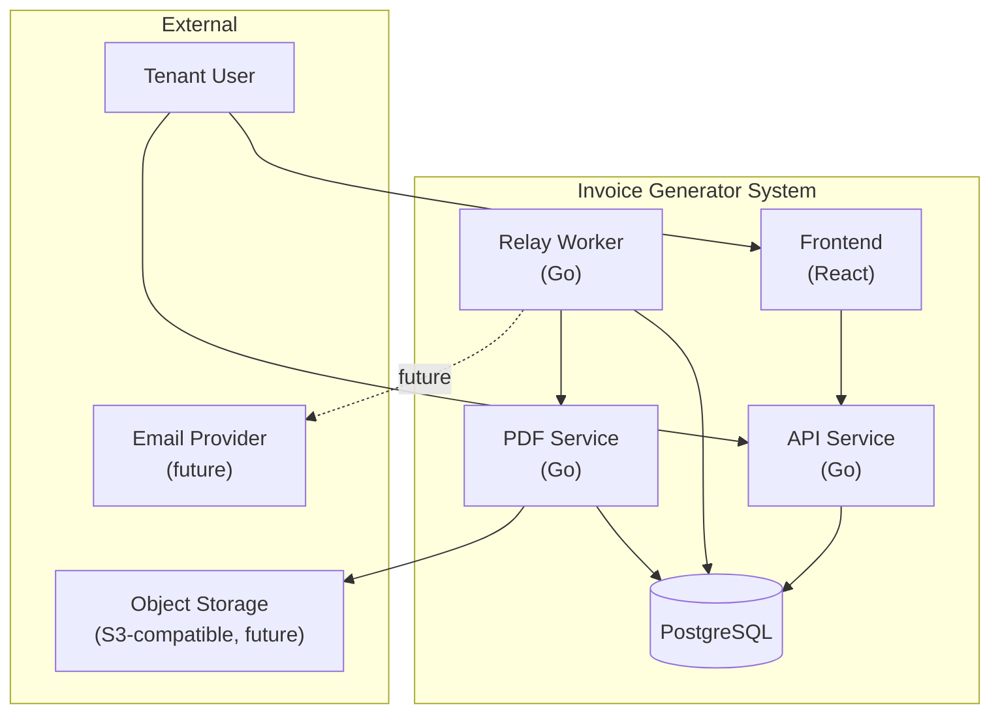
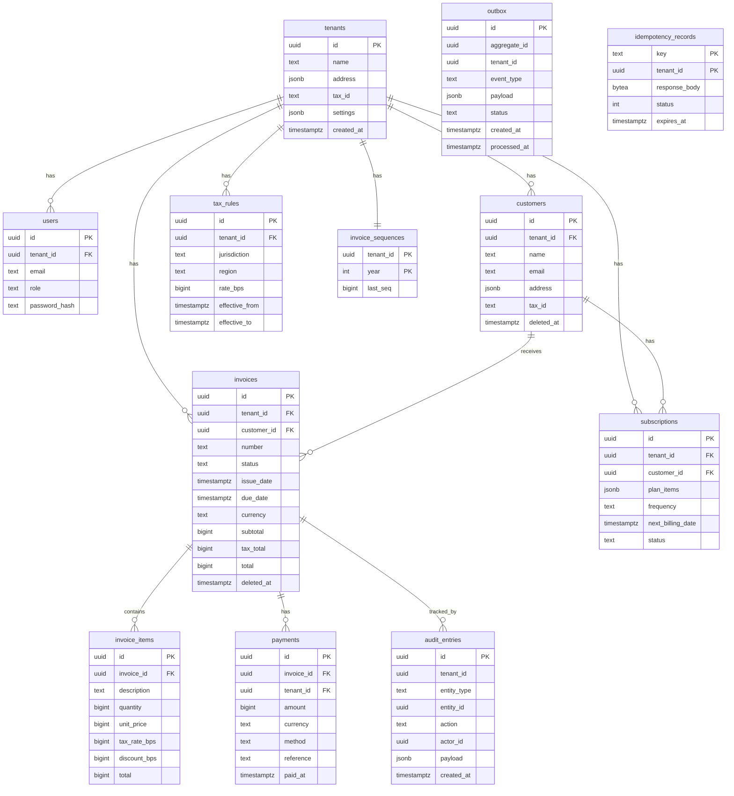

# Architecture Diagrams

## High-Level Architecture



## Hexagonal Architecture (Ports & Adapters)



## Invoice State Machine



## Outbox Pattern Flow



## Multi-Tenancy with RLS



## CQRS Flow



## Subscription Billing Worker

```mermaid
sequenceDiagram
    participant Worker as Billing Worker
    participant DB as PostgreSQL
    participant Domain
    participant Outbox

    loop Every minute
        Worker->>DB: SELECT FROM subscriptions<br/>WHERE status='active'<br/>AND next_billing_date <= NOW()<br/>FOR UPDATE SKIP LOCKED
        DB-->>Worker: Due subscriptions

        for each subscription
            Worker->>Domain: CreateInvoice(subscription.plan_items)
            Domain->>Domain: Build invoice from template
            Domain->>Domain: Issue invoice
            Worker->>DB: INSERT invoices + items
            Worker->>Outbox: INSERT outbox (invoice.issued)
            Worker->>DB: UPDATE subscription.next_billing_date
            Worker->>Outbox: INSERT outbox (subscription.renewed)
        end
    end
```

## System Context



## Data Model ERD

